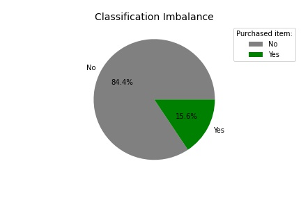
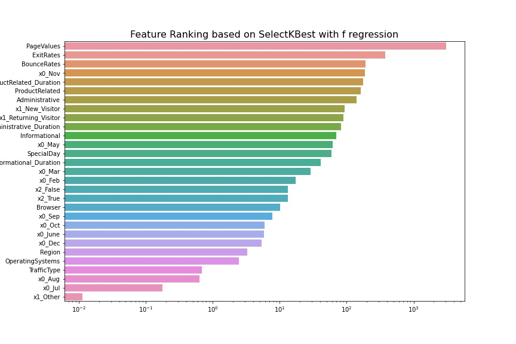
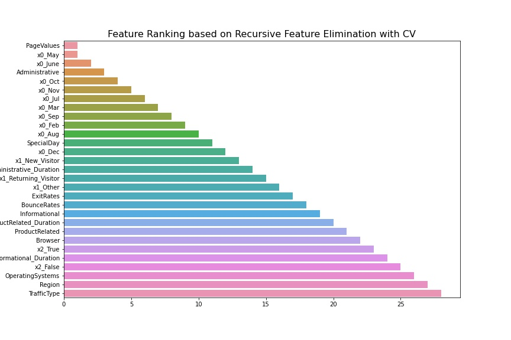
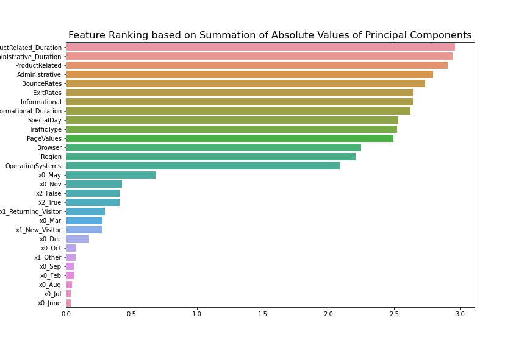
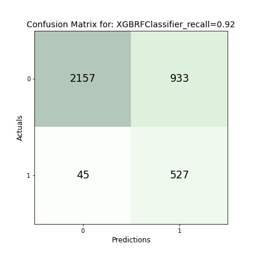
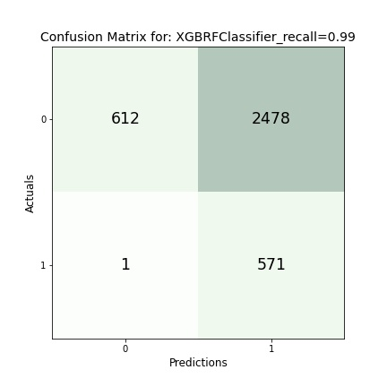
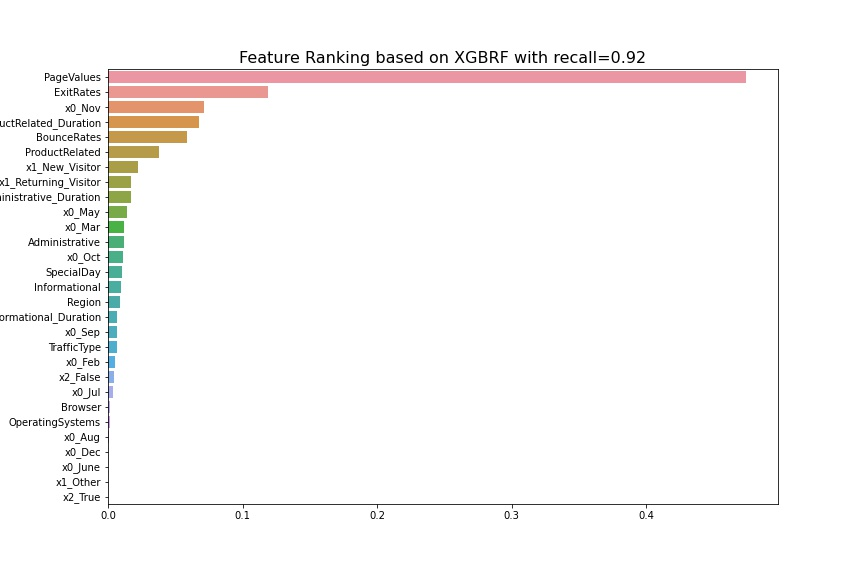

### This project is created by Ahmad Samiee

# Predict Customer Purchase Intention

## Project Overview

This project will predict customers' intention to purchase for an online retailer. This is a classification problem with an imbalanced data where only about 16% of customers purchase and the remaining 84% do not.

## Technical Summary
The metric recall is choosen as the primary metric as this measures how correctly a model can predict those customers who actually purchase. The best model has recall of about 92% where it correctly predicts 92% of all customers who actually purchase.  It also correctly predicts the majority (about 70%) of customers who do not.  A second best model has a recall of about 99% but it mis-predicts the majority of customers who do not purchase. 

## Business Problem

An online retailer wants to optimize profit margin based on visitors intent of purchase. The retailer is setting up a personalized customer experience where a visitor who is identified as some one that will make a purchase may not receive a discount. On the other hand a visitor who is identified as some one that does not intent on purchasing may be offered a promotional discount to incentivize the visitor to make a purchase. 
To predict website visitors who actually will purchase, the metric recall will be used. Recall takes false negatives (visitors who actually purchase but model predicts they do not) into consideration and therefore is a good measure of model's performance whether it can correctly identify all those visitors who purchase. 

## Master Dataset
The data comes from University of California Irvine [online_shopper](https://archive.ics.uci.edu/ml/datasets/Online+Shoppers+Purchasing+Intention+Dataset). It consist of about 12,000 records all from different users.  The data has an imbalanced classification where about 16% of visitors purchase while 84% do not. 

## EDA, Feature Engineering and Data Processing
Duplicate records were dropped. Created a new column 'mod_Revenue' and converted the boolean values in 'Revenue' column to 0 for 'no purchase' and 1 for 'purchase' using sklearn Label Encoder. The data was split into train(70% of all data) and test(30% of all data)samples and used stratify to maintain the original ratio between majority and minority class.  Using pipes, numerical features were standardized with sklearn StandardScaler or MinMaxScaler and the categorical features were OneHotEncoded. Used SMOTE on the train sample to correct for classification imbalance. 

## Feature Selection
Evaluated feature selection to see the noise in the data can be reduced. Data's features were evaluated with sklearn SelectKBest and recursive feature elimination with cross-validation. A method discussed in a paper (Assessing feature selection method performance with class imbalance data, Surani Matharaarachchi et al., Machine Learning with Applications, 2021) was also evaluated as a tool for feature selection. 
Also compared the data spread for each features between purchase and no purchase transactions.

## Prediction Models
The processed data was evaluated with following prediction models: 
* DummyClassifier as base model
* Multinomial Naive Bay as a basic model
* Logistic Regression trained with SMOTE samples
* Logistic Regression where threshhold adjusted to take into account for classification imbalance
* Multi-layer Perceptron classifier trained with SMOTE samples
* XGB Random Forest Classifier trained with SMOTE samples
* XGB Random Forest Classifier where classification imbalance adjusted through models hyperparameter (1st and 2nd best models)

Use sklearn GridSearchCV to tune models.

<table><tr>
<td> </td>
<td> </td>
</tr></table>

## Conclusion
The basic model, Multinomial Naive Bay, has a recall of about 0.76 and accuracy of 0.66.  Logistic Regression model trained with SMOTE classification corrected training data has recall of about 0.75 and improved accuracy score of about 0.85. Adjusting Logistic Regression model threshhhold to about 0.15 to take into consideration for classification imbalance increases recall to about 0.99 and reduces accuracy to 0.48. MLPClassifier trained with SMOTE classification corrected training data has a recall of about 0.83 and accuracy of 0.85.  XGBRFClassifier trained with SMOTE classification corrected training data has recall of 0.80 and accuracy of 0.87. Adjusting XGBRFClassifier hyperparameter scale_pos_weight improved recall to 0.92 and reduced accuracy to 0.73.  Making additional adjustments to this hyperperameter further increases recall to 0.99 and reduced accuracy to 0.32. 
Feature selection methods SelectKBest, recursive feature elimination and a method discussed in a data science paper called in this notebook summation of absolute values of principal components are evaluated. It appears SelectKBest method provides the most similar feature ranking to XGBRFClassifier model that has recall of about 0.92.  Adjusting models hyperparameter scale_pos_weight to increase recall to 0.99 changes the feature ranking.  This suggests feature ranking may be model dependent. 
The metric recall is choosen as the primary metric as this measures how correctly a model can predict those customers who actually purchase. The best model has a recall of about 92% where it correctly predicts 92% of all customers who actually purchase.  It also correctly predicts the majority (about 70%) of customers who do not.  A second best model has a recall of about 99% but it mis-predicts the majority of customers who do not purchase. 

## Future Consideration
* It may help with model performance if the market sector is known for the online retailer. This can help who the potential target customers are, whether seasonality is associated with purchasing and so forth.
* Another item to consider is that a more complete dataset containing activities for all 12 months may provide additional insights about customer activity. The dataset used in this notebook has no data for the months of January and December.
* Last item to consider is maybe using two models simultaneously, like one focused on predicting customers who purchase and another for those who do not. That way one can take advantage of each model’s strength and minimize the weakness.

